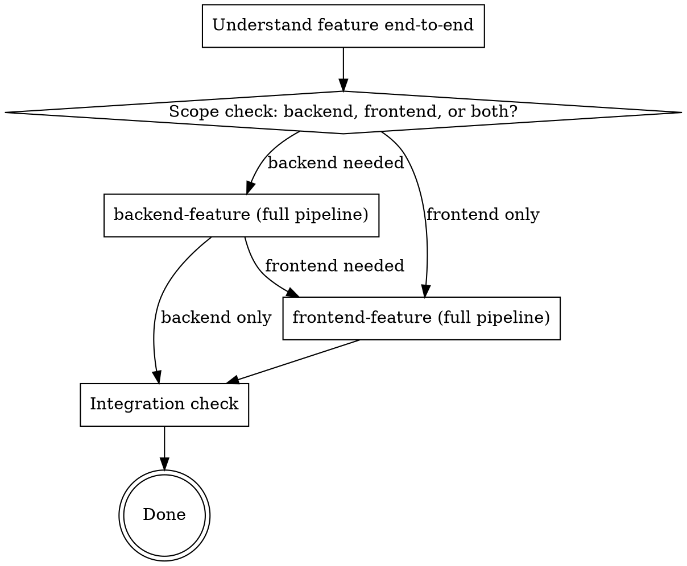

# Coco Feature Pipeline (Full-Stack)

Orchestrates a full-stack feature by running the `backend-feature` pipeline first, then the `frontend-feature` pipeline. The backend is built and reviewed before the frontend begins — so the frontend architect designs against a real, implemented API.

## Pipeline

## Step-by-Step

### Step 1 — Understand the feature end-to-end
Read the feature request. Identify both halves:
- **Backend half:** what API endpoints, data model changes, scopes are needed
- **Frontend half:** what UI, routes, components are needed

If anything is ambiguous across the boundary (e.g., what data the UI displays, what filters the API supports), ask ONE clarifying question before proceeding.

### Step 2 — Scope check
Confirm with the user which halves are in scope:
- Both backend and frontend? → continue to Step 3
- Backend only? → jump to Step 3 (backend only), skip Step 4
- Frontend only? → jump to Step 4, skip Step 3

If both halves are in scope, state the planned order explicitly: "I'll build the backend first, then the frontend."

### Step 3 — Run `backend-feature` (full pipeline)
Invoke the `backend-feature` skill. It will:
- Invoke `senior-backend-architect` to design
- Present the design and wait for user approval
- Invoke `senior-backend-developer-golang` to implement
- Invoke `code-reviewer-backend` to review
- Loop fix/review until `APPROVED`

**Do not proceed to the frontend until the backend reviewer reports `APPROVED`.**

### Step 4 — Run `frontend-feature` (full pipeline)
Invoke the `frontend-feature` skill. The frontend architect now has a concrete, implemented backend API to design against — pass the backend design (endpoints, request/response shapes, required scopes) as context.

The skill will:
- Invoke `senior-frontend-architect-react` to design
- Present the design and wait for user approval
- Invoke `senior-frontend-developer-react` to implement
- Invoke `code-reviewer-frontend` to review
- Loop fix/review until `APPROVED`

### Step 5 — Integration check
With both halves approved, verify end-to-end:
- Frontend request payload matches backend expected body
- Backend response shape matches what the frontend parses
- Required scope on the route matches what `AuthGuard` declares
- Any new `AppScopes` constants on the frontend match the backend `scopes/admin.json` catalog

If any mismatch is found, treat it as a BLOCKING finding — loop back through the relevant side's reviewer.

### Step 6 — Done
Report to the user:
- Backend: files changed, route added, migration file name, scope used
- Frontend: components created, route added, menu entry (if any), scope used
- Any ADVISORY findings left open on either side

## Rules

- **Backend first when both halves are in scope.** The frontend architect must design against a real API, not a hypothetical one.
- **Never skip design or review phases** — those are enforced by the sub-skills; do not shortcut them.
- **One user approval per side.** Backend design is approved before backend code is written. Frontend design is approved before frontend code is written. Do not bundle.
- **Scope consistency is part of the integration check.** Backend `routes.yaml` scope, frontend `AuthGuard accessScopes`, and `AppScopes` constant must all reference the same scope string.
- **If a backend change mid-frontend reveals a needed adjustment, stop and run through `backend-feature` again.** Do not silently modify backend files during the frontend pipeline.
