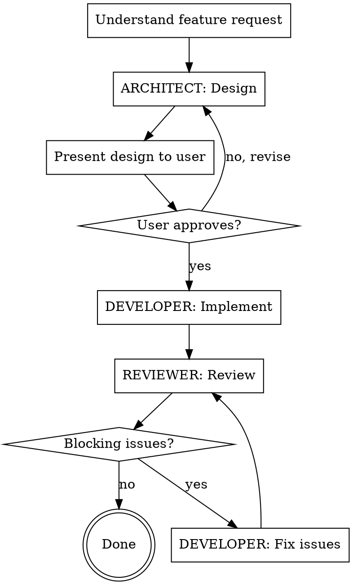

# Frontend Feature Pipeline

Orchestrates a frontend feature from idea to approved code through three roles: Architect → Developer → Reviewer, with a fix loop until the reviewer has no blocking issues.

## Pipeline

## Step-by-Step

### Step 1 — Understand the request
Read the feature request carefully. If anything is ambiguous (scope, data source, which route, which permissions), ask ONE clarifying question before proceeding. Do not ask multiple questions at once.

### Step 2 — ARCHITECT: Design
Invoke the `senior-frontend-architect-react` skill.

Produce a design covering:
- Component hierarchy and file locations
- State strategy (which context, or new one)
- Route and `accessScopes`
- API calls and repository functions
- TypeScript interfaces
- Menu entry (if needed)

### Step 3 — Present design to user
Show the design clearly. Wait for explicit approval before writing any code. If the user requests changes, revise the design and present again.

### Step 4 — DEVELOPER: Implement
Invoke the `senior-frontend-developer-react` skill.

Implement the approved design exactly. Follow the implementation checklist in that skill. Do not add features not in the design.

### Step 5 — REVIEWER: Review
Invoke the `code-reviewer-frontend` skill.

Review all changed files against the security, pattern, TypeScript, and React quality checklists. Produce a findings report in the format defined by that skill.

### Step 6 — Fix loop
If the reviewer output is `CHANGES REQUIRED`:
- Re-invoke `senior-frontend-developer-react`
- Address **every BLOCKING finding** — one by one, confirm each is resolved
- Re-invoke `code-reviewer-frontend` on the changed files
- Repeat until the reviewer output is `APPROVED`

### Step 7 — Done
Report to the user:
- What was built (component names, route, files changed)
- Any ADVISORY findings left open (with explanations)
- Confirmation that the reviewer approved

## Rules

- **Never skip the design step.** Implementation without an approved design is not allowed.
- **Never skip the review step.** "It looks fine" is not a review.
- **Fix all BLOCKING issues before reporting done.** Advisory findings may be left open with documentation.
- **Do not change scope mid-implementation.** If implementation reveals the design needs a change, surface it — don't silently expand.
